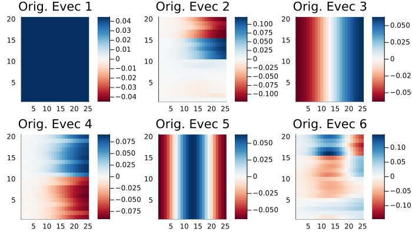
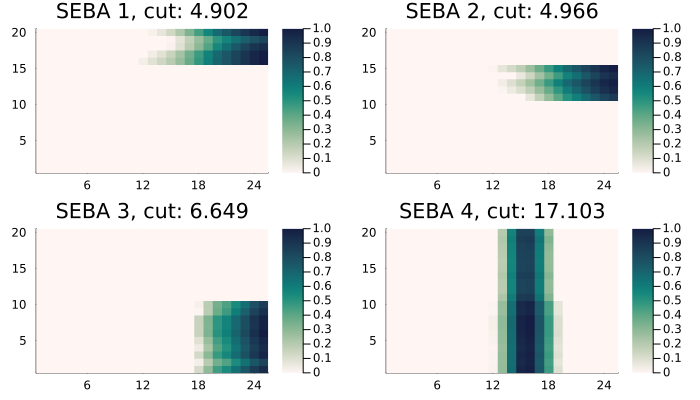

# TemporalNetworks

[](https://github.com/mkalia94/TemporalNetworks.jl/actions/workflows/CI.yml?query=branch%3Amain)
[](https://mkalia.com/TemporalNetworks.jl/dev/)

`TemporalNetworks.jl` is a package to construct and analyze graphs/networks that vary in time. The instances `MultilayerGraph`, `SpectralPartition` and `SEBAPartition`  construct temporal networks, find partitions using spacetime spectral partitioning and disentangle them using SEBA respectively. More details in the [](https://mkalia.com/TemporalNetworks.jl/dev/).


Simple example:

- Construct a spacetime network with a cluster transition architecture:

```julia
list = [0,2] # Transitition from unclustered to two emerging clusters.
degrees = nothing; η = 0.8; clusters = nothing
block = BlockGraph(20, 15, list, η, clusters, degrees)
W1 = block()
```
- Create instances and analyse:

```julia
mlgraph = MultilayerGraph(W1)
partition = SpectralPartition(mlgraph) 
seba_part  = SEBAPartition(partition,2)
```

- Plot eigenvectors and SEBA vectors
```julia
plot(plot(partition)[1:6]...)
plot(plot(seba_part)...)
```




