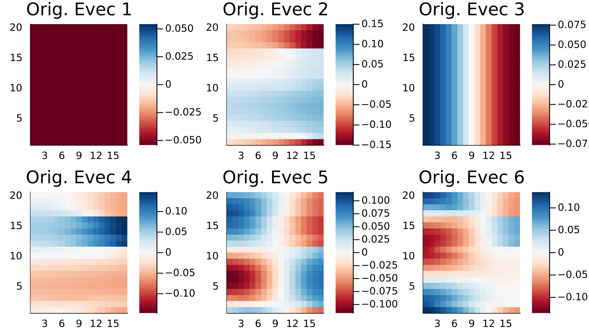
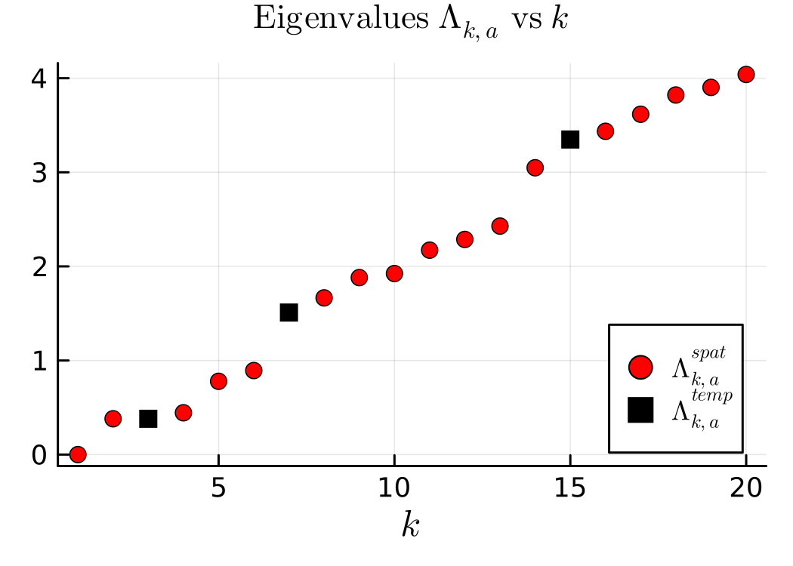
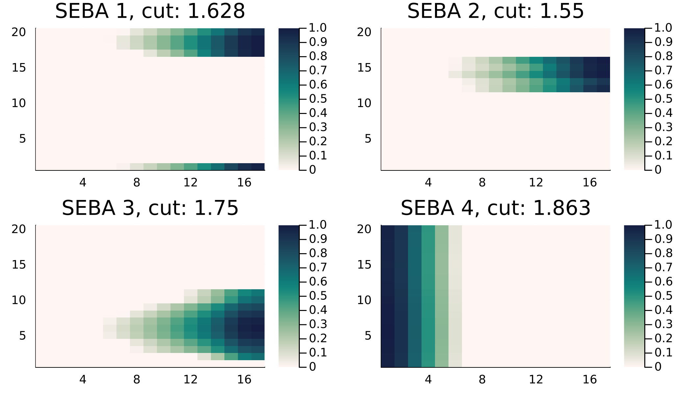
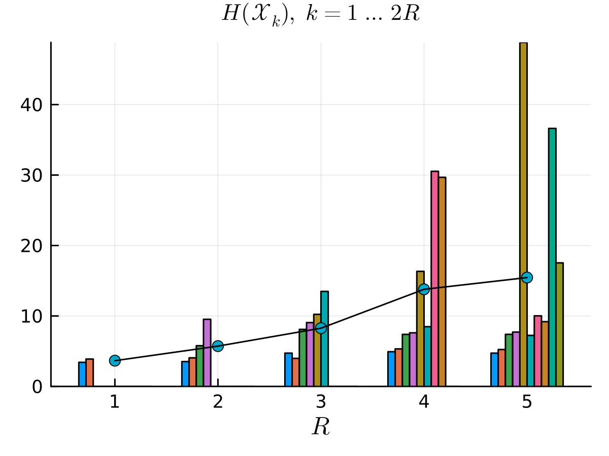
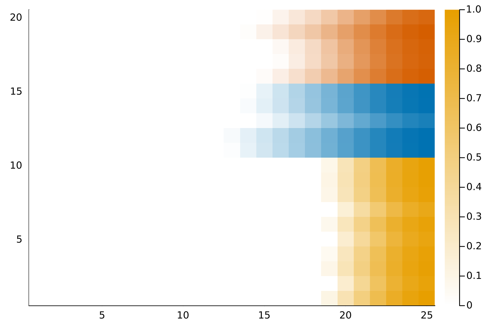

# Getting Started

## Installation

This package is not yet listed in Julia and this section will thus be updated in the future. Please obtain the latest version of Julia from [here](https://julialang.org/downloads/). Next download the package zip file from GitHub and from the directory run `julia` in the Terminal. Next run,

```@julia
julia> ] activate .

julia> ] instantiate
```

This will install the required packages and also install the required Python packages via `CondaPkg.jl`.

## Generating Multiplex Graphs

A multiplex graph can be supplied as a vector of `Float64` matrices or by using the `BlockGraph` instance to build temporal networks.

For example running the following,

```@repl
list = [0,2]
degrees = nothing
η = 0.8
clusters = nothing
block = BlockGraph(20, 15, list, η, clusters, degrees)
W1 = block()
```

returns `W1`, a `Vector{Matrix{Float64}}` containing adjacency matries ordered in time corresponding to ``20`` vertices each with transition from unclustered to the emergence of two fully intraconnected clusters.

## Building a Temporal Network

The `MultilayerGraph` instance builds a temporal network using a connection rule, of type `TemporalConnectivity`. The default is `Multiplex`.

```@repl
mlgraph = MultilayerGraph(W1, connect = Multiplex())
```
 One can visualize say the final layer using `plot(mlgraph,17)`


## Spectral Partitions and SEBA

The `SpectralPartition` and `SEBAPartition` are the most important instances that compute spectral partitions using supra-Laplacians and the SEBA algorithm.

To compute a spectral partition simply run,

```@repl
partition = SpectralPartition(mlgraph)
```

This computes the supra-Laplacian ``\mathbf L:= \mathbf L^{\rm spat} + a^2 \mathbf L^{\rm temp}`` where the parameter ``a`` is computed by finding the point where the second spatial eigenvalue ``\Lambda_{2,a}^{\rm spat}`` crosses the first temporal eigenvalue ``\Lambda_{1,a}^{\rm temp}``. This is the default case, one can also compute the exact same value using `RayleighBalancing(2)`.

The object `partition` contains the supra-Laplacian elements, the graph object `mlgraph` and the normalization for the Laplacian, which is `IdentityNormalization()` by default. Most importantly, it contains `evecs` and `evals`, which are ordered eigenvectors and eigenvalues respectively of the supra-Laplacian.

The infomation in `partition` is plotted using the `plots` command as follows,

```@julia
p1, p2 = plot(partition)
plot(p1)
plot(p2)
```





The eigenvectors 2 and 4 store (corresponding to the first two nontrivial spatial eigenvectors) important information about the partition. The partition elements embedded in the eigenvectors `evecs` are disentangled using the SEBA algorithm as follows,


```@repl
seba_part = SEBAPartition(partition,2)
```

This automatically detects the leading two non-trivial spatial eigenvectors and runs SEBA on the corresponding eigenvectors. It computes the corresponding SEBA vectors and computes the corresponding Cheeger ratios stored in `seba_part.cuts`. The vectors can be plotted as follows,

```@julia
p1,p2 = plot(seba_part)
plot(p1...)
plot(p2)
```




We see that the first three SEBA vectors are meaninful, while the last vector corresponds to a very high Cheeger ratio. Thus this is discarded. Finally the network partition can be plotted as follows,

```@julia
plot(seba_part, [1,2,3]) # 4 is removed as it is not meaningful
```


