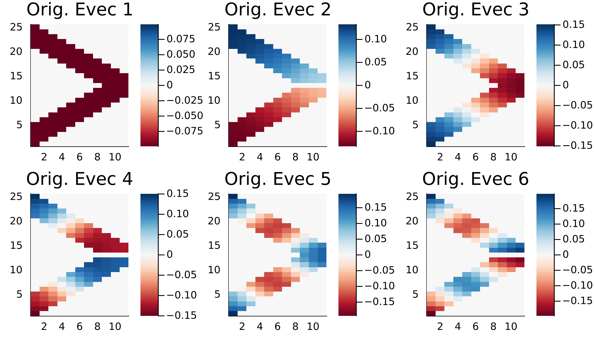
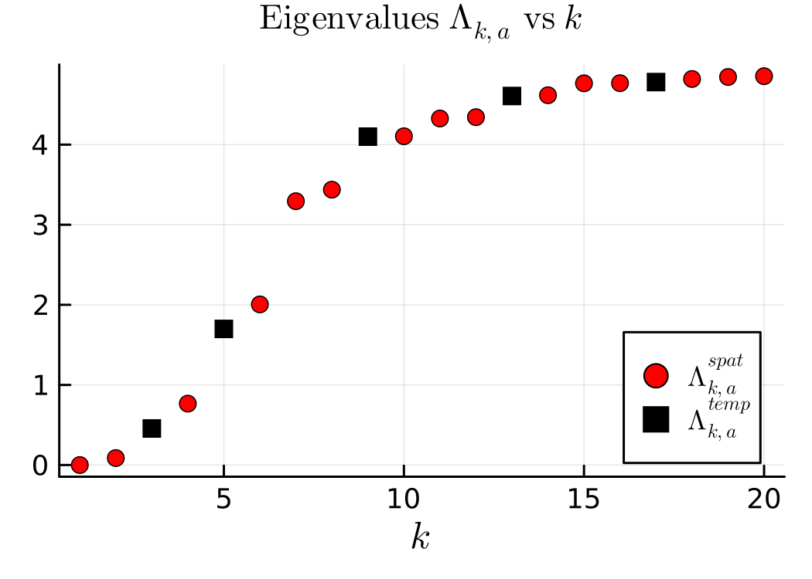
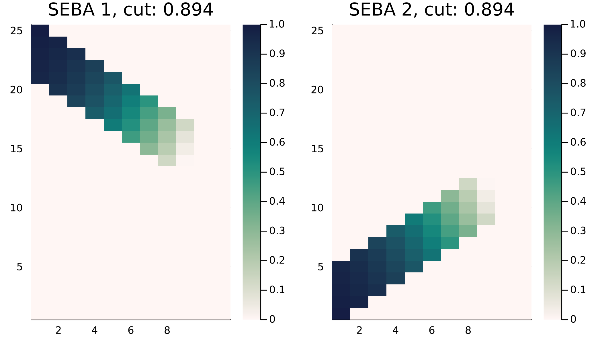

# Nonmultiplex temporal networks

In the previous section we looked at spectral partitions of multiplex networks. The same instances can be extended to nonmultiplex types. Here an example of a staircase graph is presented, which is non-multiplex in nature and can be constructed via the `BlockGraphNonMultiplex` instance as follows,

```@julia
η = 0.8
list = [2,1]
clusters = [[Array(1:5), Array(6:20), Array(21:25)],
                [Array(1:10), Array(11:20)]] # you can ignore this line
degrees = [[4,6,4],
        [6,6]] # Ignore this line
evolve = 1
block = BlockGraphNonMultiplex(25, 10, list, η, clusters, degrees, evolve)
W2 = block() |> Vector{Matrix{Float64}}
```

The network consists of 25 spatial vertices. The set of spatial vertices ``\hat {\mathcal V} := \bigcup_{t=1}^T\{x: (t,x)\in\mathcal{V}\}`` where ``\mathcal V`` is the set of spacetime vertices present in the nonmultiplex network. The network has ``10`` time steps.

One then uses the instances `MultilayerGraph`, `SpectralPartition` and `SEBAPartition` to construct and analyse spacetime partitions. These functions naturally extend to nonmultiplex network types.

!!! note

    To compute spectral partitions using `SpectralPartition`, one must compute the diffusion parameter ``a``, which is done by default using `SpatTempMatching`. Although this may also work with nonmultiplex networks, it is advisable to use `RayleighBalancing(x)` where `x` is an appropriately chosen eigenvalue index for Rayleigh balancing.

```@julia
mlgraph_nonmultiplex = MultilayerGraph(W2, connect = NonMultiplexCompressed())
partition_nonmultiplex = SpectralPartition(mlgraph_nonmultiplex, compute_a = RayleighBalancing(3)) # Rayleigh balancing on third eigenvalue
seba_part_nonmultiplex = SEBAPartition(partition_nonmultiplex,[2,])
```

Similar to before, one can plot eigenvectors, eigenvalues and SEBA vectors.

```@julia
plot(plot(partition_nonmultiplex)[1][1:6]...)
plot(plot(partition_nonmultiplex)[2])
plot(plot(seba_part_nonmultiplex)...)
```






