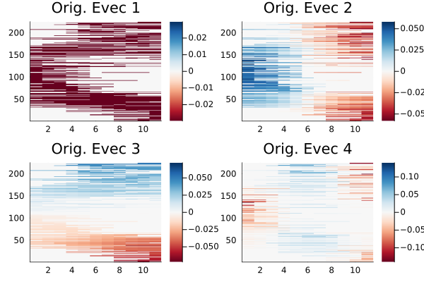
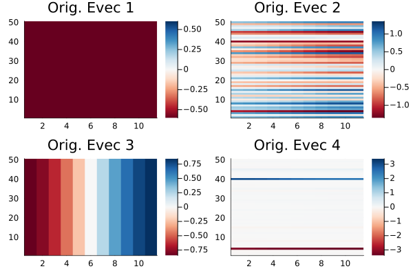
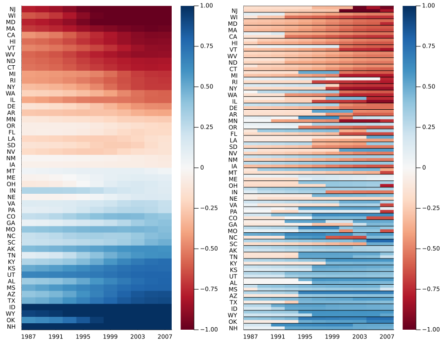

# Real world example: network of US senators

This elaborated example can be found as a `Pluto` notebook in the `PaperExamples` branch under `senator/senator_nb.jl`.

In [WPF+09](https://arxiv.org/abs/0907.3509) and [MRM+10](https://arxiv.org/abs/0911.1824) a network of senators was analyzed to understand party polarisation across time in the US Senate. We analyse the same network here in detail to discover communities that vary in time. The network data was collected from [here](https://www.voteview.com).

The network describes voting patterns between US senators/states. Each vertex corresponds to either a single senator or state, and the edge weight between any two vertices describes the voting similarity between the vertices, and lies in ``[0,1]``. More details can be found in [WPF+09](https://arxiv.org/abs/0907.3509).

Here we analyse the networks from the 100-100th congress, or the years 1987-2009.

From the CSV files obtained, one can generate adjacency matrices using the files provided in the `PaperExamples` branch under `senator/raw_data/build_dataset.jl`.

We start by loading important packages,

```julia
using TemporalNetworks, Plots, FileIO, JLD2
```

The file `senator/raw_data/build_dataset.jl` generates two collections of adjacency matrices, one each corresponding to the network of US senators and a network of US states. We load them, their labels (party affiliations/state names) and construct the `MultilayerGraph` and `SpectralPartition` instances. Note that the network of senators is nonmultiplex, while the state network is multiplex.

```julia
W = FileIO.load("senator.jld2","W")
labels_party = FileIO.load("senator.jld2","labels_party")
labels_state = FileIO.load("senator.jld2","labels_state")

mlgraph= MultilayerGraph(W, connect = NonMultiplexCompressed())
partition = SpectralPartition(mlgraph, compute_a = RayleighBalancing(2))

W_state = FileIO.load("state.jld2", "W");
lab_statelist = FileIO.load("state.jld2", "labels");
mlgraph_state = MultilayerGraph(W_state);
partition_state = SpectralPartition(mlgraph_state)
```

## The Senator network

We plot eigenvectors of the inflated dynamic Laplacian with respect to the senator network to select vectors which will induce the desired spacetime partition. 

```julia
h = plot(partition); plot(h[1][1:4]...)
```



Clearly eigenvector 3 is the first "spatial" eigenvector, which we use to construct the spacetime Laplacian. First, we carefully reorder vertices according to their temporal mean values, for visual convenience.

```julia
evec_crit = reshape(partition.evecs[:,3],mlgraph.N, mlgraph.T)
sens = find_active(mlgraph)

lengths = zeros(mlgraph.N)
for i in 1:mlgraph.N
    ctr = 0
    for x in sens
        ind = findall(y->y==i,x)
        ctr += length(ind)
    end
    lengths[i] = ctr
end

aa = sum(hcat([evec_crit[:,i] for i in 1:mlgraph.T]...), dims=2) ./ lengths
v = sortperm(aa, dims=1)[:,1]
ordering = vcat([v .+ (i-1)*mlgraph.N for i in 1:mlgraph.T]...)
```

We now use `v` and ordering from the previous cell to reorder eigenvectors, labels and the network adjacencies appropriately.

```julia
partition.evecs = partition.evecs[ordering, :]
lab_party = labels_party[v]
lab_state = labels_state[v]
mlgraph.W = [x[v,v] for x in mlgraph.W]
```

We do a small preprocessing step for the party affiliations.

```julia
for i in 1:mlgraph.N
    if lab_party[i] == 328
        lab_party[i] = 0
    elseif lab_party[i] == 100
        lab_party[i] = 1
    elseif lab_party[i] == 200
        lab_party[i] = -1
    end
end
```

## State network

Next, similar to the senator case, we plot eigenvectors of the inflated dynamic Laplacian corresponding to the state network.

```julia
h_state = plot(partition_state); plot(h_state[1][1:4]...)
```



Clearly the first spatial eigenvector is the second one (note that this is a multiplex network as opposed to the senator case). Thus we use the second eigenvector for spectral partitioning. We reorder the state vertices as well, by the magnitude of the eigenvector at the last time step.

```julia
evec_crit_state = reshape(partition_state.evecs[:,2],partition_state.graph.N, partition_state.graph.T)
v_state = sortperm(evec_crit_state[:,end])
```

## Comparing results from the senator and state network

So how do these two networks compare? The state network is an aggregate of voting similarities of different senators belonging to the same state. For each state, we have two senators per congress (two years, one time step). 

Thus we compute the projection of the third eigenvector of the senator network onto the state network. This is done by finding the two senators corresponding to each state per time step, and assigning them the value obtained from the senator network eigenvector.

```julia
evecs_temp = [reshape(partition.evecs[:,3], mlgraph.N, mlgraph.T),]
sens_ = find_active(mlgraph) 
state_proj = [zeros(2*length(lab_statelist[v_state]), partition.graph.T) for i in 1:length(evecs_temp)]
for i in 1:length(state_proj)
    for x in 1:length(lab_statelist[v_state]), y in 1:size(state_proj[i])[2]
        ind_ = findall(z->(z ∈ sens_[y] && lab_state[z] == lab_statelist[v_state][x]), 1:partition.graph.N)
        if length(ind_)==1
            state_proj[i][(x-1)*2+1,y] = evecs_temp[i][ind_[1],y]
        else
            state_proj[i][(x-1)*2+1:2*x,y] = evecs_temp[i][ind_[1:2], y]
            # None of this accounts for states that may have more than two senators in a single congress (with incomplete terms)
        end
    end
end
# Filter
for i in 1:length(state_proj)
    for (j,x) in enumerate(state_proj[i])
        if x == 0.0
            state_proj[i][j] = NaN
        end
    end
end
state_proj

state_proj[1] .*= sqrt(200);
partition_state.evecs .*= sqrt(200);
```

`state_proj` contains the projection of senator results on to the network of states. We finally plot the results,

```julia
labelss = vcat([[x; ""] for x in lab_statelist[v_state]]...);

h1 = heatmap(reshape(-partition_state.evecs[:,2],mlgraph_state.N,mlgraph_state.T)[v_state,:], c=cgrad(:RdBu), size=(600,800), yticks=(1:50,lab_statelist[v_state]), xticks=(1:2:11,1987:4:2009), dpi=300, clims = (-1,1))

h2 = heatmap(state_proj[1], c=cgrad(:RdBu), size=(600,800), yticks=(1:100,labelss), xticks=(1:2:11,1987:4:2009), dpi=300, grid=false, clims=(-1,1))

hline!(h2,0.5:2.0:(101+0.5), c=:black, labels="", lw=1)

plot(h1, h2, size=(900,700))
```



The state and senator networks show a "fading-in" of polarisation as time passes. Note that the red-blue split is exactly along party lines.


